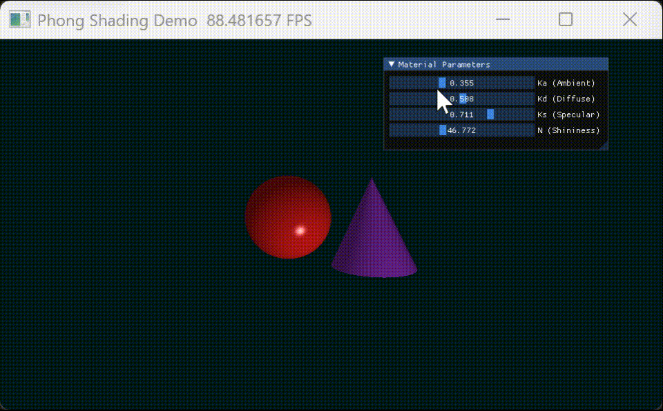

# Taichi Phong Shading

## 1. 实验目标

本实验基于 Taichi 实现了一个简单的三维 Phong 光照渲染程序。通过 Ray Casting 的方式从相机向屏幕中的每个像素发射射线，判断射线与场景中几何体的交点，并在交点处计算 Phong 光照模型，最终生成具有环境光、漫反射和镜面高光效果的图像。

实验主要目标如下：

1. 理解 Phong 光照模型的基本组成。
2. 掌握环境光、漫反射和镜面高光的计算方法。
3. 实现射线与球体、圆锥体的求交。
4. 实现基于深度的最近交点选择。
5. 使用 Taichi 的 GUI 与 Kernel 完成实时渲染和参数调节。

---

## 2. 实验原理

Phong 光照模型将物体表面的最终颜色分为三个部分：

```text
I = I_ambient + I_diffuse + I_specular
```

其中：

- `I_ambient` 表示环境光；
- `I_diffuse` 表示漫反射；
- `I_specular` 表示镜面高光。

### 2.1 环境光 Ambient

环境光用于模拟场景中经过多次反射后均匀分布的背景光，其强度与物体表面朝向无关。

```text
I_ambient = Ka * C_light * C_object
```

其中：

- `Ka` 为环境光系数；
- `C_light` 为光源颜色；
- `C_object` 为物体本身颜色。

### 2.2 漫反射 Diffuse

漫反射用于模拟粗糙表面对光线的均匀散射。其强度取决于光照方向与表面法向量之间的夹角。

```text
I_diffuse = Kd * max(0, N · L) * C_light * C_object
```

其中：

- `Kd` 为漫反射系数；
- `N` 为表面法向量；
- `L` 为交点指向光源的方向向量；
- `N · L` 表示光线方向和法线方向的夹角关系。

当 `N · L` 越大时，表面越朝向光源，亮度越高；当 `N · L <= 0` 时，说明表面背向光源，不产生漫反射。

### 2.3 镜面高光 Specular

镜面高光用于模拟光滑表面对光线的集中反射。其强度取决于观察方向与理想反射方向之间的夹角。

```text
I_specular = Ks * max(0, R · V)^n * C_light
```

其中：

- `Ks` 为镜面高光系数；
- `R` 为光线关于法线的理想反射方向；
- `V` 为交点指向相机的观察方向；
- `n` 为高光指数 Shininess。

`Shininess` 越大，高光区域越集中；`Shininess` 越小，高光区域越分散。

---

## 3. 实验内容

本实验实现了一个包含红色球体和紫色圆锥体的三维场景。程序通过相机向屏幕中每个像素发射射线，分别计算射线与球体、圆锥体的交点，然后选择距离相机最近的有效交点进行 Phong 着色。

场景中的主要对象包括：

| 对象 | 说明 |
|---|---|
| 红色球体 | 用于展示球面上的连续法线变化和光照过渡 |
| 紫色圆锥体 | 用于展示不同几何表面上的光照效果 |
| 点光源 | 为场景提供主要照明 |
| 相机 | 从固定位置观察场景 |
| UI 面板 | 用于实时调整 Phong 光照参数 |

---

## 4. 项目结构

```text
taichi-phong-homework/
├── README.md
├── requirements.txt
├── .gitignore
├── docs/
│   └── output.gif
└── src/
    ├── __init__.py
    ├── main.py
    ├── app.py
    ├── config.py
    ├── geometry.py
    ├── shading.py
    └── math_utils.py
```

各文件作用如下：

| 文件 | 作用 |
|---|---|
| `main.py` | 程序入口 |
| `app.py` | 创建窗口、UI 面板和主循环 |
| `config.py` | 保存相机、光源、物体、颜色和渲染参数 |
| `geometry.py` | 实现射线与球体、圆锥体的求交计算 |
| `shading.py` | 实现 Phong 光照模型 |
| `math_utils.py` | 提供向量归一化、反射方向等数学工具函数 |
| `docs/output.gif` | 用于存放实验运行效果 GIF |

---

## 5. 核心实现

### 5.1 射线生成

程序为屏幕上的每个像素生成一条从相机出发的射线。通过将二维像素坐标映射到三维视平面上，可以得到该像素对应的射线方向。

每条射线可表示为：

```text
P(t) = O + tD
```

其中：

- `O` 为相机位置；
- `D` 为射线方向；
- `t` 为射线参数；
- `P(t)` 为射线上的点。

### 5.2 球体求交

球体由球心 `C` 和半径 `r` 定义。将射线方程代入球体方程：

```text
|P - C|² = r²
```

可得到一个关于 `t` 的二次方程。通过判断判别式可以确定射线是否与球体相交。

若存在多个交点，取距离相机最近且在相机前方的交点。

### 5.3 圆锥体求交

圆锥体由顶点、底面高度和半径定义。程序分别计算射线与圆锥侧面、底面的交点，并判断交点是否位于有效范围内。

圆锥体求交过程主要包括：

1. 计算射线与圆锥侧面的交点；
2. 判断交点高度是否在圆锥范围内；
3. 计算射线与圆锥底面的交点；
4. 判断底面交点是否在圆形底面内部；
5. 选择最近的有效交点。

### 5.4 深度测试

同一条射线可能同时与多个物体相交。为了保证显示正确的遮挡关系，程序会比较不同交点到相机的距离，选择最近的有效交点作为当前像素的最终着色点。

深度测试逻辑如下：

```text
if t_object < t_current:
    update nearest hit
```

这样可以确保前方物体遮挡后方物体，得到正确的三维空间关系。

### 5.5 Phong 着色

在获得交点位置和表面法线后，程序分别计算环境光、漫反射和镜面高光，并将三部分结果相加得到最终颜色。

计算流程如下：

1. 计算交点位置；
2. 计算表面法向量 `N`；
3. 计算光照方向 `L`；
4. 计算观察方向 `V`；
5. 计算反射方向 `R`；
6. 分别计算 Ambient、Diffuse、Specular；
7. 将三部分颜色相加并限制到合法颜色范围内。

---

## 6. 交互参数设计

实验中提供了四个可调节的 Phong 光照参数：

| 参数 | 含义 | 默认值 | 作用 |
|---|---:|---:|---|
| `Ka` | 环境光系数 | `0.2` | 控制整体基础亮度 |
| `Kd` | 漫反射系数 | `0.7` | 控制物体受光面的明暗变化 |
| `Ks` | 镜面高光系数 | `0.5` | 控制高光强度 |
| `Shininess` | 高光指数 | `32.0` | 控制高光范围和集中程度 |

通过调节这些参数，可以观察不同光照分量对最终图像的影响。

例如：

- 增大 `Ka`，物体整体变亮；
- 增大 `Kd`，受光面与背光面的明暗对比更加明显；
- 增大 `Ks`，高光更加明显；
- 增大 `Shininess`，高光范围变小但更加集中。

---

## 7. 实验结果

程序最终渲染出一个包含红色球体和紫色圆锥体的三维场景。球体表面能够看到平滑的明暗过渡，圆锥体表面能够体现出不同法线方向带来的光照变化。

在调节 UI 参数时，画面会实时更新，能够直观观察 Ambient、Diffuse、Specular 和 Shininess 对渲染结果的影响。

### 运行效果 GIF

效果展示如下：



---

## 8. 实验分析

通过本实验可以观察到：

1. 环境光决定了场景的最低亮度，避免背光区域完全变黑。
2. 漫反射是物体主体明暗变化的主要来源，能够表现物体表面朝向与光源之间的关系。
3. 镜面高光能够增强物体表面的光滑感。
4. 高光指数越大，高光越集中，物体越接近光滑材质。
5. 深度测试能够正确处理多个物体之间的遮挡关系。
6. 使用 Taichi Kernel 可以较高效地完成逐像素并行计算。

---

## 9. 实验总结

本实验完成了基于 Taichi 的 Phong 光照渲染程序，实现了射线生成、几何体求交、深度测试、表面法线计算和 Phong 着色等功能。

通过本实验，我进一步理解了三维渲染中局部光照模型的基本原理，也掌握了环境光、漫反射和镜面高光在图像生成中的作用。同时，通过实时调节参数，可以更加直观地观察不同光照参数对最终渲染效果的影响。

整体来看，本实验较好地实现了 Phong Shading 的核心功能，并能够通过 UI 交互展示不同光照分量对渲染结果的影响。